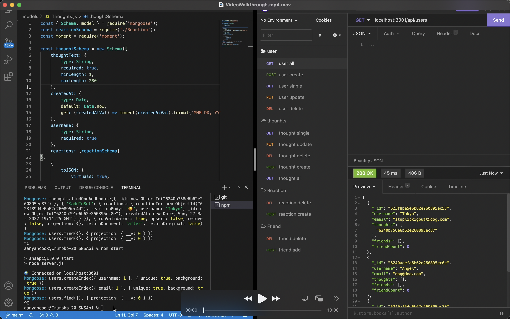

# SNSApi a.k.a Social Network Api
A REST API for a social media app. Built with Express, Mongoose, and MongoDB. 
### User Story
AS A social media startup
I WANT an API for my social network that uses a NoSQL database
SO THAT my website can handle large amounts of unstructured data

### Video Walkthrough
Using Insomia

(https://youtu.be/xqfSASVmNT0)